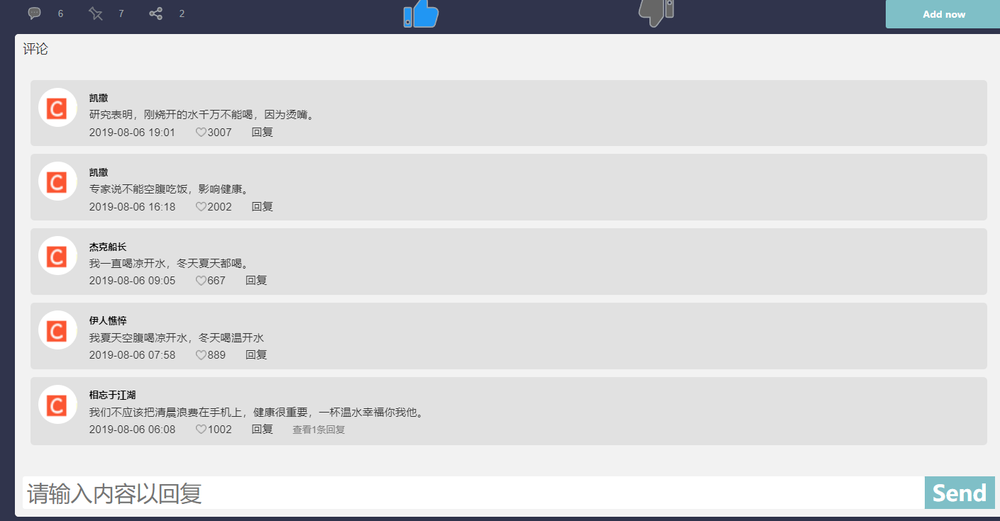
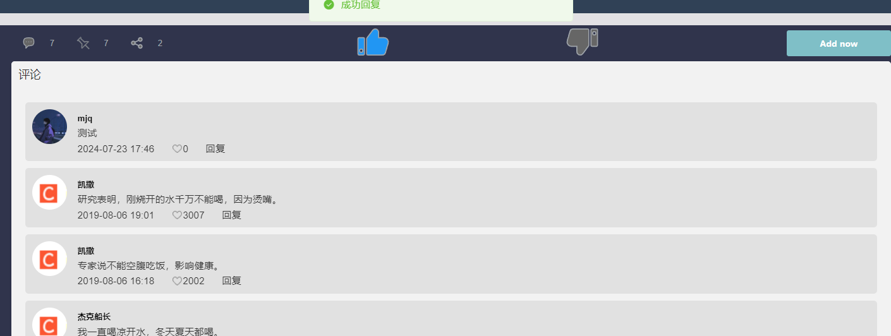
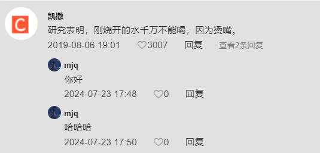
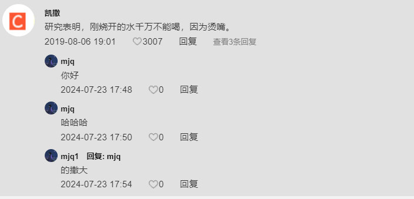
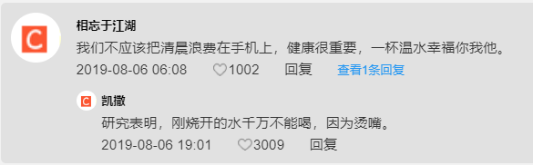
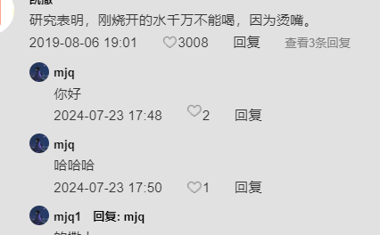

V3.0

新增功能:评论

基于MongoDB实现

### 功能展示

在共享书签页面可以看到书签的评论情况

可以通过点击评论按钮展开(评论按照时间倒序展示)

可以在下方输入内容以回复

也可以点击 回复 来回复特定用户

子评论默认按时间顺序排列

点击子评论的回复时,会有对应回复信息(此处mjq和mjq1不是同一个用户)

子评论默认折叠，可通过点击进行展开

点击爱心可以对评论点赞

MongoDB的一些配置

ip及端口: localhost:27017

数据库: articledb

表格:

db.comment.insertMany([{"_id":"1","articleid":"52","content":"我们不应该把清晨浪费在手机上，健康很重要，一杯温水幸福你我他。","userid":"1002","avatar":"http://images:19205/2becb2aa-698f-48ba-9084-19e19cd81ee7.jpg","nickname":"相忘于江湖","createdatetime":new Date("2019-08-05T22:08:15.522Z"),"likenum":NumberInt(1000),"state":"1"},{"_id":"2","articleid":"52","content":"我夏天空腹喝凉开水，冬天喝温开水","userid":"1005","avatar":"http://images:19205/2becb2aa-698f-48ba-9084-19e19cd81ee7.jpg","nickname":"伊人憔悴","createdatetime":new Date("2019-08-05T23:58:51.485Z"),"likenum":NumberInt(888),"state":"1"},{"_id":"3","articleid":"52","content":"我一直喝凉开水，冬天夏天都喝。","userid":"1004","avatar":"http://images:19205/2becb2aa-698f-48ba-9084-19e19cd81ee7.jpg","nickname":"杰克船长","createdatetime":new Date("2019-08-06T01:05:06.321Z"),"likenum":NumberInt(666),"state":"1"},{"_id":"4","articleid":"52","content":"专家说不能空腹吃饭，影响健康。","userid":"1003","avatar":"http://images:19205/2becb2aa-698f-48ba-9084-19e19cd81ee7.jpg","nickname":"凯撒","createdatetime":new Date("2019-08-06T08:18:35.288Z"),"likenum":NumberInt(2000),"state":"1"},{"_id":"5","articleid":"52","content":"研究表明，刚烧开的水千万不能喝，因为烫嘴。","userid":"1003","avatar":"http://images:19205/2becb2aa-698f-48ba-9084-19e19cd81ee7.jpg","nickname":"凯撒","createdatetime":new Date("2019-08-06T11:01:02.521Z"),"likenum":NumberInt(3000),"state":"1"},{"_id":"6","articleid":"52","content":"研究表明，刚烧开的水千万不能喝，因为烫嘴。","userid":"1003","avatar":"http://images:19205/2becb2aa-698f-48ba-9084-19e19cd81ee7.jpg","nickname":"凯撒","parentid":"1","createdatetime":new Date("2019-08-06T11:01:02.521Z"),"likenum":NumberInt(3000),"state":"1"} ])