V1.0

功能介绍:

管理端：用户、管理员、书签、书签类型表的增删改查

用户端：查看共享书签,添加书签，自身书签的增删改查,个人信息展示和修改

## 搭建

小皮面板搭建存储图片的网站,路径为E:/images     端口号为 19205

(此处路径要一致。不是这个路径的话需要更改后端代码中有关 文件上传部分代码)

### 启动前端项目

方法一: 使用Nginx 启动(已打包好)

方法二:使用Vue-cli脚手架 通过npm run dev启动项目

###启动后端项目

使用idea打开项目，正常启动

### 访问:

管理端: localhost:90   用户端:localhost:80

## 项目展示

(1)首页

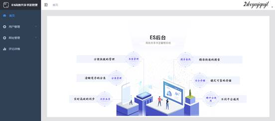

图4-3.1 管理端首页图

(2)用户管理页

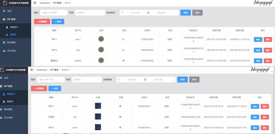

图4-3.2 管理端用户管理图

(3)网址详情页

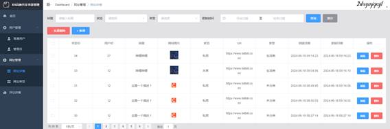

图4-3.3 管理端网址详情图

(4)网址类型页

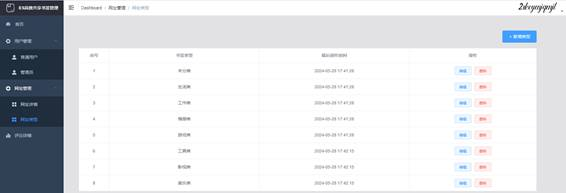

图4-3.4 管理端网址类型图

(5)具体功能

                   

图4-3.5 管理端新增或修改用户图      图4-3.6 管理端新增或修改书签图

图4-3.7 管理端新增或修改书签类型图

(6)核心代码(部分)

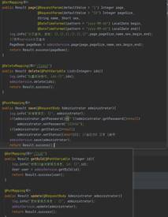 

图4-3.8 管理端后端用户核心代码图   图4-3.9 管理端前端书签核心代码图

用户、管理员、书签、书签类型的增删改查功能均实现。并且删除书签类型时，对应该类型的书签的类型会初始化为未分类

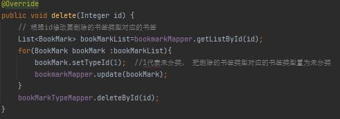

图4-3.10 管理端后端书签类型删除核心代码图

**4.4****用户端主页面实现**

(1)共享页

图4-4.1 用户端共享页图

用户共享页可以查看书签类型为共享的书签,并且前端页面支持向下无限滚动获取新书签,可以通过点击书签介绍右侧的 Add Now 按钮，添加到自身的书签中。

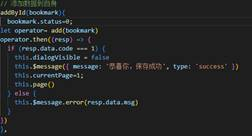  

图4-4.2 用户端前端共享核心代码图   图4-4.3 用户端后端共享核心代码图

添加共享书签到用户书签中,需要后端使用拦截器设置请求的用户ID,之后使用控制层中save方法，设置当前用户id及书签状态为私密。

(2)我的书签页

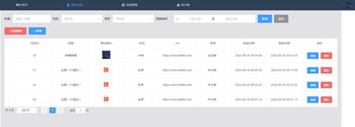

图4-4.4 用户端我的书签页图

​     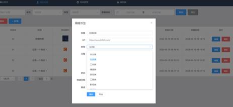

图4-4.5 用户端我的书签添加或修改图

(3)个人信息页

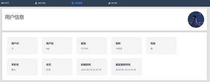

图4-4.6 用户端个人信息页图

(4)信息修改页

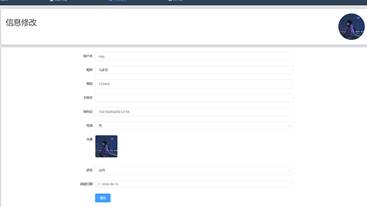

图4-4.7 用户端信息修改页图

(5)顶部栏用户信息

            

图4-4.8用户信息图         图4-4.9 用户信息前端核心代码图

## 部分功能展示

(1)书签管理功能测试

书签添加测试：验证能否成功添加包含各种字段（如标题、链接、描述等）的书签，检查数据的完整性和准确性。

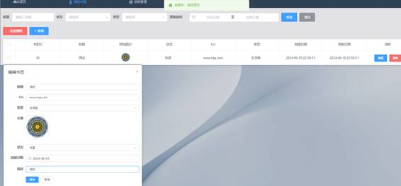

图5-1.1 书签添加测试图

书签删除测试：尝试删除不同状态（如正常、已共享等）的书签，确认相关数据被正确删除，且不会影响其他关联数据。

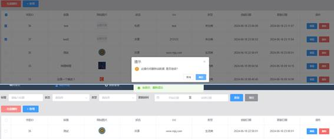

图5-1.2 书签删除测试图

 

书签修改测试：修改书签的各项属性，如标题、链接、描述等，确保修改后的数据能够正确保存和显示。

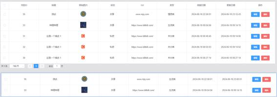

图5-1.3 书签修改测试图

书签查询测试：使用不同的查询条件（如关键词、分类等），验证查询结果的准确性和完整性。

图5-1.4 书签查询测试图

(2)用户管理功能测试

用户注册测试：检查注册流程的正确性和对非法输入的处理。

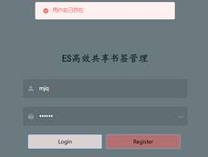

图5-1.5 用户注册测试图1        图5-1.6 用户注册测试图2

用户登录测试：使用正确和错误的用户名/密码组合进行登录尝试，验证登录的安全性和错误处理机制。

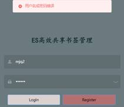

图5-1.7 用户登录测试图1        图5-1.8 用户登录测试图2

用户信息修改测试：修改用户的个人信息（如昵称、头像等），确认修改成功并在系统中正确显示。

图5-1.9 用户信息修改测试图1

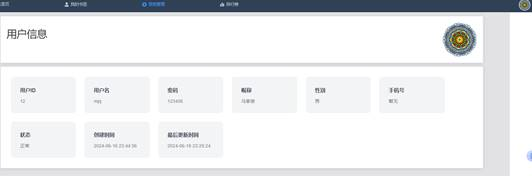

图5-1.9 用户信息修改测试图2

(3)书签类型管理功能测试

书签类型创建测试：创建新的书签类型，检查类型名称、描述等信息的保存和显示。

 

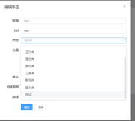

图5-1.10 书签类型创建测试图1                图5-1.11 书签类型创建测试图2

书签类型删除测试：删除已存在的书签类型，观察是否正常删除。

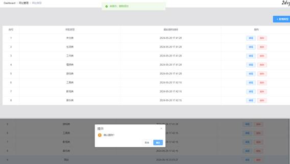

图5-1.12 书签类型删除测试图

书签类型修改测试：修改书签类型的属性，验证修改结果的准确性。

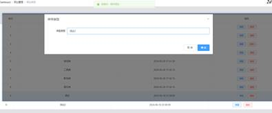

图5-1.13 书签类型修改测试图

 

(4)共享功能测试

书签共享测试：用户将其他用户共享的书签添加到自身书签

图5-1.14 共享功能测试图1

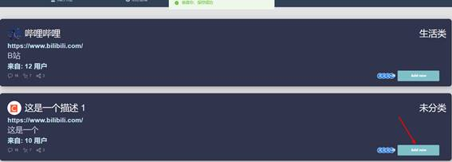

图5-1.15 共享功能测试图2

图5-1.16 共享功能测试图3

共享权限设置测试：设置不同的共享权限（如只读、可编辑等），验证权限的有效性。

图5-1.17 共享权限测试图1

图5-1.18 共享权限测试图2

图5-1.19 共享权限测试图3

图5-1.20 共享权限测试图4

(5)管理端特殊功能测试

管理端删除书签类型测试：重点测试当管理端删除书签类型时，对应类型的书签是否正确初始化为未分类。

图5-1.21 特殊功能测试图1

图5-1.22 特殊功能测试图2

 

图5-1.23 特殊功能测试图3

